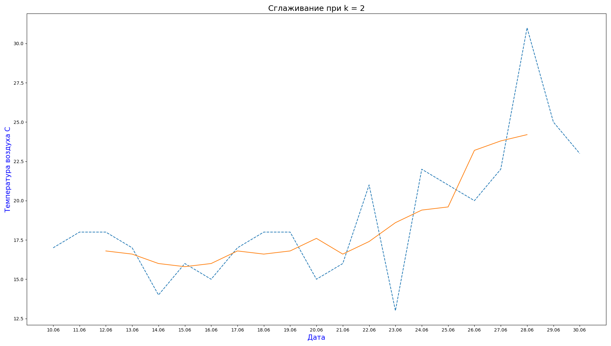
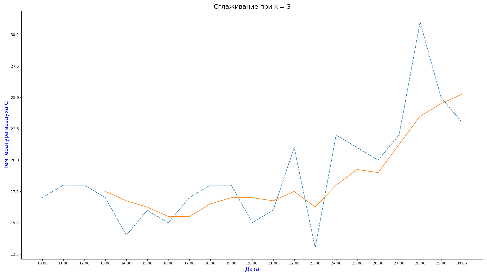
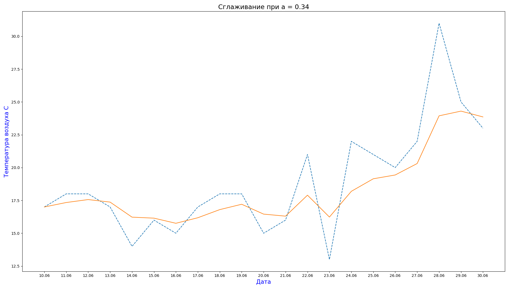

#Data science

- There are some simple data algorithms to create graphics and change something
- something.py - is the example of finding the trend function
- graph.py is the example of finding the SMA (метод скользящего среднего) offline

- graph-2.py is the example of finding the SMA (метод скользящего среднего) online

- graph-3.py is the example of finding the EMA (метод экспоненциального сглаживания) online

